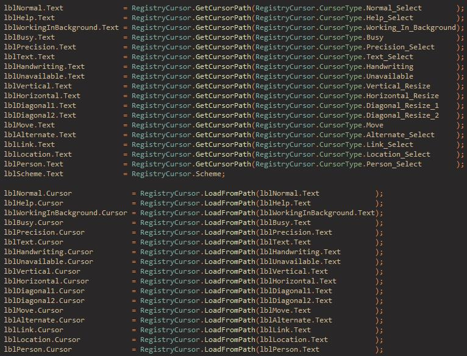

## RegistryCursors
### Description
Gets the file paths to the cursors currently used by the system's current user.

### How To Use
```csharp
// this is the code you want inside your program when it first loads
// also don't worry about 'using' statements
// it's all at the 'root'

string cursorPath_Link = RegistryCursor.GetCursorPath(RegistryCursor.CursorType.Link_Select);

// if Console
Console.WriteLine(cursorPath_Normal);

// if WinForms
// 'Text' being the 'Text property' of the current window
// 'Cursor' being the 'Cursor property' of the current window
Text = cursorPath_Link;
Cursor = RegistryCursor.LoadFromPath(cursorPath_Link);
```
```csharp
// this is the actual code you should have for your basic program

// if WinForms
using System.Windows.Forms;

namespace YOUR_PROGRAM
{
    public partial class Form1: Form
    {
        public Form1()
        {
            InitializeComponent();
            
            // get the cursor path into a string
            string cursorPath_Link = RegistryCursor.GetCursorPath(RegistryCursor.CursorType.Link_Select);
            Text = cursorPath_Link;
            
            // just returns Cursors.Arrow if no cursor is found or loaded
            Cursor = RegistryCursor.LoadFromPath(cursorPath_Link);
        }
    }
}

// if Console
using System;

namespace YOUR_PROGRAM
{
    public static class Program
    {
        public static void Main(string[] args)
        {
            string cursorPath_Normal = RegistryCursor.GetCursorPath(RegistryCursor.Normal);
            Console.WriteLine(cursorPath_Normal);
        }
    }
}
```

### It Actually Works
These cursor files are specific to MY computer by the way.<br/>
(Just to let you know.)<br/>



### Download
[Standalone](https://github.com/Lexz-08/RegistryCursors/releases/download/registry-cursors/RegistryCursors.dll)
